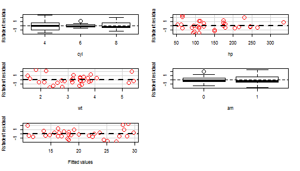
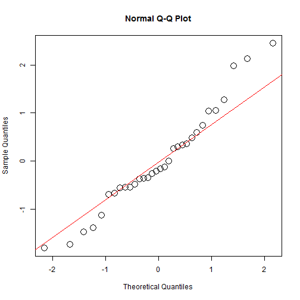

## Summary

The present project predicts how many miles per galon a car spends with very basic information (number of cylindres, horsepower, weight and type of transmission). The prediction is made with the mtcars data set given in the R software. 

--- .class #id 

## Algorithm

The code that is used in the application is described below. From all the possible variables available in the data, the number of cylindres, the horsepower, the weight and the type of transmission are the most significant values to predict by a linear regresion according to the ACL criterium


```r
        set.seed(123)
        mtcars2=mtcars
        mtcars2$cyl=as.factor(mtcars2$cyl)
        mtcars2$vs=as.factor(mtcars2$vs)
        mtcars2$am=as.factor(mtcars2$am)
        mtcars2$gear=as.factor(mtcars2$gear)
        mtcars2$carb=as.factor(mtcars2$carb)
        model1=lm(mpg~cyl+hp+wt+am,data = mtcars2)
```

--- .class #id 

## Residual Analysis 

The graph of the residuals versus the fitted values and  the residuals versus each variable can be seen below:



The distribution of the residuals seem to be random and sugest a constant viarnce.
Additionally, most of the residuals are between -2, 2 so it can be concluded that the assumptions of the models are met.

--- .class #id 

## Normality

The residuals have a normal distribution as it is shown below:




